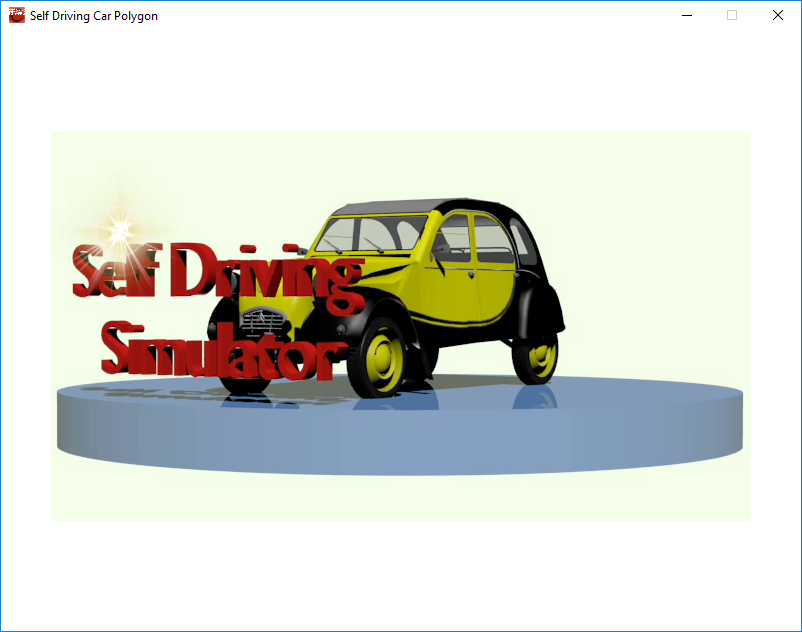
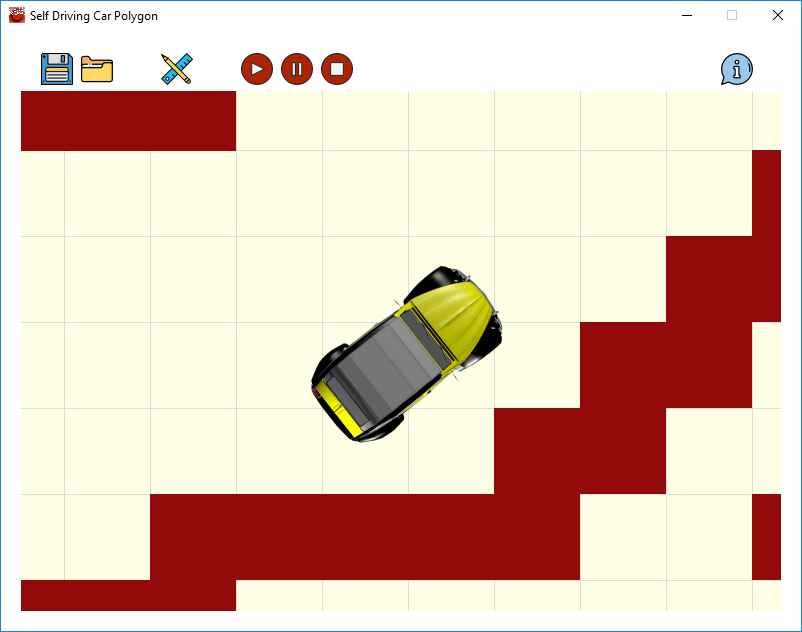
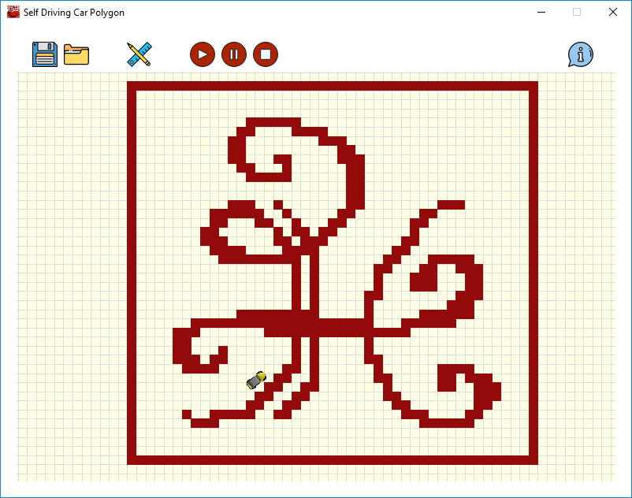

# Self-Driving Car Simulator
### Simulator for self-driving experimentation

## Introduction
Self-Driving Car Simulator which is intended for use in experimenting with artificial intelligence (AI)
and machine learning (ML) models.

Designed using pyGame from the scratch. Work is still in progress.

Visual design is doen using Blender
Car model is borrowed from open space: https://www.blendswap.com/blends/view/69982 License CC Zero

## Run

Start game_main.py file from src folder. Make sure that Requirements section are satisfied.
From windows console:  
C:\path_to_main> python game_main.py

Self-Driving Car Simulator Intro Movie Screenshot
[comment]: 

Self-Driving Car Simulator Zoom Screensot
[comment]: 

Self-Driving Car Simulator Screenshot
[comment]: 

## Requirements

1. Python 3.6.4
2. Pygame 1.9.3

## References
[1] ['Implementing Neural Network used for Self Driving Cars from NVIDIA with Interactive code'](https://towardsdatascience.com/implementing-neural-network-used-for-self-driving-cars-from-nvidia-with-interactive-code-manual-aa6780bc70f4), Towards Data Science
